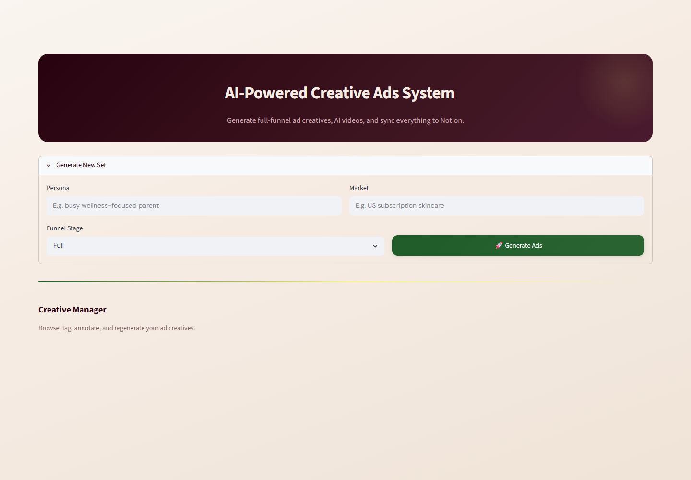
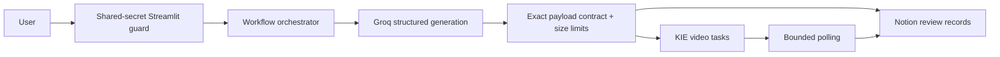

# AI-Powered Creative Ads System

A controlled Streamlit workspace that turns a persona, market, and funnel focus into seven validated ad variants, five video concepts, and a Notion review queue. It integrates Groq for copy, KIE/Runway for asynchronous video jobs, and Notion for durable human review; it does not publish ads automatically.



The screenshot is a genuine local render of the application shell. Generated cards, video progress, and Notion records appear only after authentication and correctly configured provider credentials.

## Architecture



The validator enforces the exact set ID, echoed inputs, five unique prompts, seven A–G ads, language/funnel/video mappings, required copy, and bounded provider text. External errors are converted to generic UI messages so response bodies and operational details are not exposed. Transient provider failures receive one bounded retry.

## Setup

Requires Python 3.10+ and Groq, KIE, and Notion accounts.

```bash
python -m venv .venv
source .venv/bin/activate              # Windows: .venv\Scripts\activate
python -m pip install -r requirements.txt
cp .env.example .env
python -m streamlit run app.py
```

Configure:

| Variable | Required | Purpose |
| --- | --- | --- |
| `CREATIVE_ADS_ACCESS_TOKEN` | yes | Long random shared secret; app fails closed without it |
| `GROQ_API_KEY` | yes | Structured copy generation |
| `KIE_API_KEY` | yes | Video task creation and status |
| `NOTION_API_KEY` / `NOTION_DATABASE_ID` | yes | Review records |
| `NOTION_VERSION` | yes | Notion API contract version |
| `NOTION_DATA_SOURCE_ID` | no | Alternate page parent |
| `KIE_CALLBACK_URL` | no | KIE callback URL; must be an operator-controlled HTTPS endpoint |

The Notion database needs `Set ID`, `Persona`, `Market`, `Funnel Stage`, `Ad Label`, `Language`, `Headline`, `Primary Text`, `CTA`, `Video ID`, `Video URL`, `Reused?`, and `Status`. Optional `Tag`, `Iteration`, and `Notes` fields enable review workflows.

## Creative contract

| Ad | Stage | Language | Video | Reused |
| --- | --- | --- | --- | --- |
| A/B/C | Awareness | EN | V1/V2/V3 | no |
| D/E | Mid | EN | V4 | E only |
| F | Conversion | EN | V5 | no |
| G | Full | ES | V4 | yes |

Persona is capped at 500 characters, market at 300, and each generated copy/prompt field at 8,000. Five video jobs are submitted only after the LLM payload validates. Polling stops after 60 attempts per job.

## Testing and CI

```bash
python -m ruff check .
python -m pytest
```

CI runs both gates on Python 3.10 and 3.12. Provider integration tests mock all HTTP calls, verify retry/error behavior and request contracts, and incur no paid usage.

## Costs and operations

Every successful generation can request one or more Groq completions and five KIE videos; regeneration adds Groq calls. Provider prices and model availability change, so consult their current dashboards, configure hard spend caps, and monitor request volume before deployment. Notion may impose rate limits. The app is synchronous and keeps active run state in the Streamlit session; it has no queue, distributed lock, durable task scheduler, or usage ledger.

## Security and threat model

Controls address unauthenticated UI access, oversized prompt/output fields, malformed model JSON, HTML injection in rendered provider text, credential leakage through provider errors, transient failures, unbounded Notion pagination, and endless video polling. Secrets remain server-side and ignored local secret files must never be committed.

Residual risks include shared-secret reuse, provider data retention, prompt injection through user inputs or Notion content, SSRF/open-redirect implications of an operator-supplied callback URL, a single Streamlit process, and partial cross-provider writes. For public or multi-user deployment, put the app behind OIDC/SSO, add per-user authorization and quotas, validate callback destinations, use a durable job queue/idempotency keys, centralize audit logs, and define retention/deletion procedures. Human approval remains mandatory before ad publication and legal/brand review.

## Repository map

- `app.py`: authenticated Streamlit UI, orchestration, polling, and review actions.
- `services/llm.py`: Groq client and structured prompts.
- `services/video.py`: KIE task/status adapter.
- `services/notion.py`: schema-aware persistence and bounded pagination.
- `services/validator.py`: strict creative contract and output limits.
- `tests/`: deterministic unit and mocked integration coverage.
- `docs/architecture.md`: deeper data-flow notes.

## License

All rights reserved. This public repository is provided for portfolio, review, and demonstration purposes; see `LICENSE` for the exact terms.
