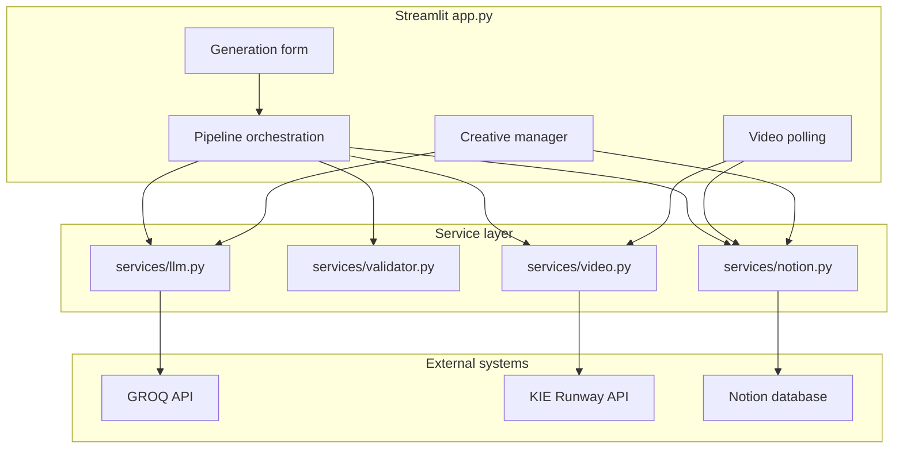

# AI-Powered Creative Ads System

A Streamlit application for generating, validating, storing, and iterating full-funnel ad creative sets with AI-generated copy, AI video tasks, and a Notion-backed creative review workflow.

This project is built around a practical marketing operations problem: turning a persona and market brief into a structured creative set that a human can review, tag, annotate, and improve without losing the relationship between copy, video prompts, funnel stage, and iteration history.

## What It Does

The app accepts a target persona, market, and funnel focus, then orchestrates a creative production pipeline:

1. Generate a structured JSON payload through the GROQ chat completions API.
2. Validate that the payload contains the expected creative set contract.
3. Create one Notion page per ad creative.
4. Submit video generation tasks through the KIE Runway API.
5. Poll video status and update matching Notion rows when assets complete.
6. Let a human browse, filter, tag, annotate, and regenerate individual ads from a Streamlit dashboard.

Each generation produces:

- 7 ad creatives labeled A through G.
- 5 distinct video prompts labeled V1 through V5.
- English awareness, mid-funnel, and conversion variants.
- One Spanish full-funnel variant.
- A deterministic mapping between ad labels, funnel stages, languages, video IDs, and reused video assets.

## Why This Matters

Most AI creative demos stop at text generation. This repo demonstrates the harder production concerns around AI-assisted creative workflows:

- Structured output validation before data is persisted.
- Human-in-the-loop review instead of automatic campaign launch.
- Durable creative records in an external workspace.
- Asset state tracking across asynchronous video generation.
- Single-ad regeneration that preserves the rest of a creative set.
- Unit tests and CI around the code that protects the data contract.

For recruiters and reviewers, the important signal is not just that the app calls AI APIs. It shows orchestration, external service integration, schema discipline, UI workflow design, and operational boundaries between AI generation and human judgment.

## Feature Highlights

### Full-Funnel Creative Generation

The LLM prompt asks for a complete creative set with headlines, primary text, CTAs, and video prompts. The validator enforces the exact set shape before the app writes anything to Notion.

| Ad | Funnel Stage | Language | Video | Reused? | Purpose |
| --- | --- | --- | --- | --- | --- |
| A | Awareness | EN | V1 | No | Top-of-funnel hook |
| B | Awareness | EN | V2 | No | Alternative awareness angle |
| C | Awareness | EN | V3 | No | Third awareness variant |
| D | Mid | EN | V4 | No | Consideration / engagement |
| E | Mid | EN | V4 | Yes | Copy variant using the same visual concept |
| F | Conversion | EN | V5 | No | Direct-response creative |
| G | Full | ES | V4 | Yes | Spanish-language full-funnel variant |

### AI Video Task Orchestration

The app submits five 5-second vertical video jobs to KIE's Runway endpoint with:

- `duration`: 5 seconds
- `quality`: 720p
- `aspectRatio`: 9:16
- optional callback URL support via `KIE_CALLBACK_URL`

The Streamlit UI polls task status, tracks progress, handles failures, and updates Notion pages with finished video URLs.

### Notion Creative Manager

Notion acts as the creative source of truth. The app can:

- create Notion pages for each generated ad
- query all sets or a specific set
- filter cards by set, funnel stage, and tag
- save tags such as Draft, Testing, Needs Revision, Approved, and Winner
- save notes on individual creatives
- update video URL and status fields after video generation
- regenerate one ad's copy without regenerating the whole set

### Validation Layer

`services/validator.py` protects the pipeline from malformed model output. It checks:

- top-level JSON keys
- expected `set_id`
- exact input echoing for persona, market, and funnel stage
- exactly five unique video prompts
- exactly seven creatives labeled A-G
- required creative fields
- language, funnel-stage, video, and reuse mappings

## Architecture



The app is intentionally small: a single Streamlit entry point coordinates a focused service layer. There is no separate worker, database server, queue, or backend API in this repository.

For a more detailed architecture note, see [docs/architecture.md](docs/architecture.md).

## Tech Stack

| Layer | Technology | Role |
| --- | --- | --- |
| UI and orchestration | Streamlit | Dashboard, forms, polling, creative cards |
| LLM integration | GROQ API, `llama-3.3-70b-versatile` | Ad copy and video prompt generation |
| Video generation | KIE Runway API | Text-to-video task creation and status polling |
| Persistence | Notion API | Creative records, status, tags, notes, video URLs |
| HTTP client | Requests | External API calls |
| Configuration | python-dotenv | Local `.env` loading |
| Testing | pytest | Unit tests for validation and Notion helpers |
| Linting | Ruff | Import and Python lint checks |
| CI | GitHub Actions | Matrix checks on Python 3.10 and 3.12 |

## Repository Structure

```text
.
|-- app.py                    # Streamlit UI and generation workflow orchestration
|-- docs/
|   `-- architecture.md       # Detailed architecture and data-flow notes
|-- services/
|   |-- llm.py                # GROQ chat completions client and prompt construction
|   |-- notion.py             # Notion schema, create, update, query, and extraction helpers
|   |-- validator.py          # Strict creative payload validation
|   `-- video.py              # KIE Runway video task creation and polling
|-- tests/
|   |-- test_notion.py        # Unit tests for Notion property builders
|   `-- test_validator.py     # Unit tests for creative payload validation
|-- .env.example              # Required and optional environment variables
|-- .github/workflows/ci.yml  # Ruff + pytest CI matrix
|-- pyproject.toml            # Project metadata and tool configuration
|-- requirements.txt          # Runtime dependencies
`-- requirements-dev.txt      # Runtime + development dependencies
```

## Getting Started

### Prerequisites

- Python 3.10 or newer
- A GROQ API key
- A KIE API key with access to the Runway endpoints used by the app
- A Notion integration token
- A Notion database with the required properties listed below

### Install

Windows PowerShell:

```powershell
python -m venv .venv
.\.venv\Scripts\Activate.ps1
python -m pip install -r requirements.txt
Copy-Item .env.example .env
```

macOS or Linux:

```bash
python -m venv .venv
source .venv/bin/activate
python -m pip install -r requirements.txt
cp .env.example .env
```

Edit `.env` with your API keys and Notion database ID, then run:

```bash
python -m streamlit run app.py
```

## Environment Variables

The repository includes [.env.example](.env.example).

| Variable | Required | Purpose |
| --- | --- | --- |
| `GROQ_API_KEY` | Yes | Authenticates calls to the GROQ chat completions API |
| `KIE_API_KEY` | Yes | Authenticates KIE Runway video task calls |
| `NOTION_API_KEY` | Yes | Notion integration token |
| `NOTION_DATABASE_ID` | Yes | Target Notion database for creative records |
| `NOTION_VERSION` | Yes | Notion API version; example uses `2022-06-28` |
| `NOTION_DATA_SOURCE_ID` | No | Optional Notion data source parent for page creation |
| `KIE_CALLBACK_URL` | No | Optional callback URL passed to the video API |
| `NOTION_DB_VIEW_URL` | No | Optional override for the "View in Notion" link in the app |

Do not commit real credentials. `.env`, `.env.*`, and `.streamlit/secrets.toml` are ignored by Git.

## Notion Database Schema

The app expects these required Notion properties to exist:

| Property | Expected Type | Description |
| --- | --- | --- |
| `Set ID` | title or rich text | Unique generation set identifier |
| `Persona` | rich text | Target audience/persona input |
| `Market` | rich text | Market input |
| `Funnel Stage` | select | Awareness, Mid, Conversion, or Full |
| `Ad Label` | rich text or select | A through G |
| `Language` | select | EN or ES |
| `Headline` | rich text or title | Generated headline |
| `Primary Text` | rich text | Generated body copy |
| `CTA` | rich text | Generated call to action |
| `Video ID` | rich text | V1 through V5 |
| `Video URL` | url | Completed video URL |
| `Reused?` | checkbox | Whether the video is shared with another ad |
| `Status` | status | Generation and video state |

Optional properties supported by the app:

| Property | Expected Type | Description |
| --- | --- | --- |
| `Tag` | select | Draft, Testing, Needs Revision, Approved, Winner |
| `Iteration` | number | Regeneration count |
| `Notes` | rich text | Human feedback and annotations |

The Notion helper supports multiple property types for some fields, but the safest setup is to mirror the table above.

## Scripts and Development Commands

Install development dependencies:

```bash
python -m pip install -r requirements-dev.txt
```

Run linting:

```bash
python -m ruff check .
```

Run tests:

```bash
python -m pytest
```

Run the app locally:

```bash
python -m streamlit run app.py
```

## Testing and CI

Automated coverage currently focuses on the highest-risk pure-Python logic:

- strict LLM payload validation
- single-creative validation
- Notion property construction
- Notion update payload construction
- Notion database URL formatting

The GitHub Actions workflow in `.github/workflows/ci.yml` runs:

- `python -m ruff check .`
- `python -m pytest`

The matrix runs on Python 3.10 and 3.12.

## Security and Privacy Notes

- Secrets are read from environment variables and should stay out of version control.
- The app sends persona, market, feedback, and generated creative text to external APIs.
- Generated video prompts are sent to KIE's Runway endpoint.
- Creative records, notes, tags, and video URLs are stored in the configured Notion database.
- There is no authentication or role-based access control layer in this Streamlit app.
- The app is a creative workflow tool, not a compliance review or media buying system.

Review provider terms, data retention, and internal approval requirements before using real customer, brand, or regulated campaign data.

## Troubleshooting

### "Required credentials are not configured."

Check that `.env` exists, contains the required variables, and is loaded from the directory where you start Streamlit.

### "Notion database is missing required properties."

Create the required properties listed in the Notion schema section. Property names must match exactly.

### "Invalid JSON from model."

The LLM response did not parse as strict JSON after a retry. Try a simpler persona or market prompt, then run again.

### Video generation stays pending.

The app polls for completion and stops auto-refreshing after repeated attempts. Use the Refresh button or check the KIE task/provider status.

### Notion pages are created but videos do not appear.

Video generation can fail independently from text generation. The text creatives remain available even when one or more video tasks fail.

## Current Limitations

- No deployed URL or public demo is included in this repository.
- No screenshots are committed.
- No local mock mode for GROQ, KIE, or Notion API calls.
- No end-to-end tests around live external services.
- No background worker; video polling is handled inside the Streamlit session.
- No built-in user accounts, permissions, or multi-tenant isolation.
- No campaign publishing, ad account integration, or performance analytics.

## Roadmap Ideas

- Add a mocked demo mode for reviewers without API credentials.
- Add integration tests with mocked external API responses.
- Add a Notion schema bootstrap/check command.
- Persist generation run state outside Streamlit session state.
- Add downloadable creative exports.
- Add provider-agnostic interfaces for LLM and video services.
- Add screenshot or GIF assets once a real demo flow is available.

## Project Positioning

This repo is a compact example of AI product engineering: it combines prompt design, structured validation, API orchestration, async task tracking, human review workflows, and automated quality checks in a small but realistic application.
