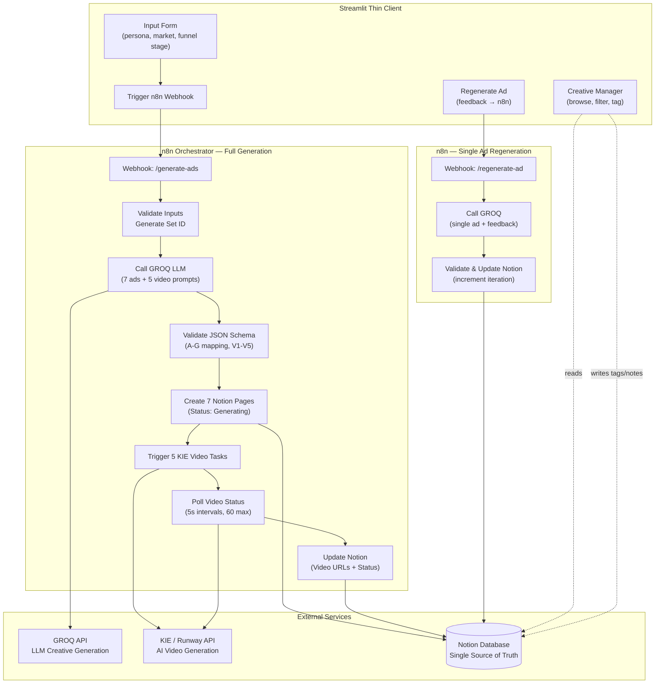

# System Architecture — AI Creative Ads Generator

## Overview

This system generates full-funnel ad creative sets using AI, produces video assets, and manages the creative lifecycle through a Notion-backed workflow. It separates **AI generation** from **human judgment** to enable continuous, scalable creative production.

---

## System Diagram



---

## Where AI Ends and Human Judgment Begins

```
┌─────────────────────────────────────────────────────────────┐
│                        AI DOMAIN                            │
│                                                             │
│  GROQ LLM generates:                                       │
│    • 7 ad creatives (headlines, copy, CTAs)                 │
│    • Multi-language variants (EN + ES)                      │
│    • Funnel-stage targeting (Awareness → Conversion)        │
│                                                             │
│  KIE / Runway generates:                                    │
│    • 5 distinct video assets (720p, 9:16)                   │
│    • Visual concepts aligned to funnel intent               │
│                                                             │
│  Schema Validator ensures:                                  │
│    • Correct A-G creative mapping                           │
│    • V1-V5 video assignment                                 │
│    • Structural integrity before any human review           │
│                                                             │
├─────────────────────────── HANDOFF ─────────────────────────┤
│                                                             │
│                      HUMAN DOMAIN                           │
│                                                             │
│  Creative Manager enables:                                  │
│    • Review all generated creatives                         │
│    • Tag: Winner / Approved / Testing / Needs Revision      │
│    • Add notes and feedback per ad                          │
│    • Regenerate individual ads with specific feedback        │
│    • Track iteration count per creative                     │
│                                                             │
│  Final Decisions (human only):                              │
│    • Which creatives go live                                │
│    • Budget allocation across funnel stages                 │
│    • Market-specific adjustments                            │
│    • Brand tone and compliance approval                     │
│    • Performance-based iteration priorities                 │
│                                                             │
└─────────────────────────────────────────────────────────────┘
```

---

## Data Flow

```
1. USER INPUT
   Persona + Market + Funnel Stage
        │
        ▼
2. n8n ORCHESTRATION
   Webhook → GROQ LLM → JSON Validation → Notion Pages → Video Tasks → Polling → Notion Updates
        │
        ▼
3. NOTION (Source of Truth)
   7 creative pages with:
   - Set ID, Ad Label (A-G), Funnel Stage, Language
   - Headline, Primary Text, CTA
   - Video ID, Video URL, Status
   - Tag, Iteration, Notes
        │
        ▼
4. CREATIVE MANAGER
   Browse → Filter → Tag → Annotate → Regenerate
        │
        ▼
5. ITERATION LOOP
   Feedback → n8n Regen Workflow → Updated Notion Page → Repeat
```

---

## Creative Set Structure

| Ad | Funnel Stage | Language | Video | Reused? | Purpose |
|----|-------------|----------|-------|---------|---------|
| A  | Awareness   | EN       | V1    | No      | Top-of-funnel hook |
| B  | Awareness   | EN       | V2    | No      | Alternative awareness angle |
| C  | Awareness   | EN       | V3    | No      | Third awareness variant |
| D  | Mid         | EN       | V4    | No      | Consideration / engagement |
| E  | Mid         | EN       | V4    | Yes     | Copy variant of D (same video) |
| F  | Conversion  | EN       | V5    | No      | Direct response / CTA-heavy |
| G  | Full        | ES       | V4    | Yes     | Spanish market variant |

---

## Technology Stack

| Layer | Technology | Role |
|-------|-----------|------|
| Frontend | Streamlit | Interactive web UI |
| Orchestration | n8n | Workflow automation, API coordination |
| LLM | GROQ API (GPT-OSS-120B) | Creative copy generation |
| Video | KIE / Runway API | AI video generation |
| Database | Notion API | Creative storage, tagging, lifecycle |
| Config | python-dotenv | Environment variable management |

---

## Modes of Operation

**n8n Mode** (production): Streamlit triggers n8n webhooks; n8n handles all pipeline logic; results read from Notion.

**Direct Mode** (fallback): Pipeline runs entirely inside Streamlit; useful for development or when n8n is not available.

The mode is auto-detected based on whether `N8N_WEBHOOK_URL` is set in the environment.
