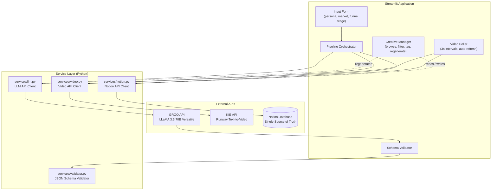

# System Architecture — AI-Powered Creative Ads System

## Overview

This system generates full-funnel ad creative sets using AI, produces video assets, and manages the creative lifecycle through a Notion-backed dashboard. It separates **AI generation** from **human judgment** to enable continuous, scalable creative production.

The entire pipeline — from LLM generation to video creation to Notion storage — runs within a single Streamlit application with no external orchestration dependencies.

---

## System Diagram



---

## Pipeline Flow

```
1. USER INPUT
   Persona + Market + Funnel Stage
        │
        ▼
2. LLM GENERATION
   GROQ API (LLaMA 3.3 70B) generates structured JSON:
   • 7 ad creatives (A-G) with headlines, primary text, CTAs
   • 5 video prompts (V1-V5) aligned to funnel intent
        │
        ▼
3. SCHEMA VALIDATION
   Validates JSON structure:
   • A-G creative mapping with correct funnel stages
   • V1-V5 video prompt assignment
   • Language mapping (EN for A-F, ES for G)
   • Automatic retry with corrective prompt on failure
        │
        ▼
4. NOTION PAGE CREATION
   Creates 7 pages in Notion database with:
   • Set ID, Ad Label, Funnel Stage, Language
   • Headline, Primary Text, CTA
   • Video ID assignment, Status: Not started
        │
        ▼
5. VIDEO GENERATION
   Triggers 5 video tasks via KIE/Runway API:
   • 5-second vertical clips (720p, 9:16 aspect ratio)
   • Optimized for social media (Reels, TikTok, Shorts)
        │
        ▼
6. VIDEO POLLING
   Auto-refreshes every 3 seconds:
   • Checks video status for each task
   • Updates Notion pages with video URLs on completion
   • Updates status to Generated when all videos complete
   • Displays real-time progress (X/5 complete)
        │
        ▼
7. CREATIVE MANAGER
   Single-page dashboard to manage all creatives:
   • Browse and filter by set, funnel stage, language, tag
   • Preview videos inline alongside ad copy
   • Tag: Draft / Testing / Needs Revision / Approved / Winner
   • Add notes and feedback per creative
   • Regenerate individual ads with specific feedback
        │
        ▼
8. ITERATION LOOP
   Feedback → LLM regenerates single ad → Notion page updated → Repeat
```

---

## Where AI Ends and Human Judgment Begins

```
┌─────────────────────────────────────────────────────────────┐
│                        AI DOMAIN                            │
│                                                             │
│  LLM (LLaMA 3.3 70B via GROQ) generates:                  │
│    • 7 ad creatives (headlines, primary text, CTAs)         │
│    • Multi-language variants (EN + ES)                      │
│    • Funnel-stage targeting (Awareness → Conversion)        │
│    • 5 video prompts aligned to funnel intent               │
│                                                             │
│  KIE / Runway generates:                                    │
│    • 5 distinct video assets (5s, 720p, 9:16)              │
│    • Visual concepts from AI-written video prompts          │
│                                                             │
│  Schema Validator ensures:                                  │
│    • Correct A-G creative mapping                           │
│    • V1-V5 video assignment                                 │
│    • Structural integrity before any human review           │
│    • Auto-retry with corrective prompts on failure          │
│                                                             │
├─────────────────────────── HANDOFF ─────────────────────────┤
│                                                             │
│                      HUMAN DOMAIN                           │
│                                                             │
│  Creative Manager enables:                                  │
│    • Review all generated creatives with inline video       │
│    • Tag: Winner / Approved / Testing / Needs Revision      │
│    • Add notes and feedback per ad                          │
│    • Regenerate individual ads with specific feedback        │
│    • Track iteration count per creative                     │
│                                                             │
│  Final Decisions (human only):                              │
│    • Which creatives go live                                │
│    • Budget allocation across funnel stages                 │
│    • Market-specific adjustments                            │
│    • Brand tone and compliance approval                     │
│    • Performance-based iteration priorities                 │
│                                                             │
└─────────────────────────────────────────────────────────────┘
```

---

## Creative Set Structure

Each generation produces **7 ad creatives** mapped across the full marketing funnel, paired with **5 AI-generated videos**. Two ads reuse videos to test copy variations against the same visual.

| Ad | Funnel Stage | Language | Video | Reused? | Purpose |
|----|-------------|----------|-------|---------|---------|
| A  | Awareness   | EN       | V1    | No      | Top-of-funnel hook |
| B  | Awareness   | EN       | V2    | No      | Alternative awareness angle |
| C  | Awareness   | EN       | V3    | No      | Third awareness variant |
| D  | Mid         | EN       | V4    | No      | Consideration / engagement |
| E  | Mid         | EN       | V4    | Yes     | Copy variant of D (same video) |
| F  | Conversion  | EN       | V5    | No      | Direct response / CTA-heavy |
| G  | Full        | ES       | V4    | Yes     | Spanish market variant |

**Why this structure?**
- 3 Awareness variants (A-C) allow A/B/C testing at top of funnel
- Mid-funnel pair (D-E) tests copy variation with identical video
- Conversion ad (F) has its own dedicated video for direct response
- Spanish variant (G) reuses V4 to test multi-language with proven visual

---

## Notion Database Schema

### Required Properties (13)

| Property | Type | Description |
|----------|------|-------------|
| Headline | title | Ad headline (Notion title column) |
| Set ID | rich_text | Unique generation set identifier (e.g. SET-7335547288) |
| Persona | rich_text | Target audience description |
| Market | rich_text | Market segment |
| Funnel Stage | select | Awareness / Mid / Conversion / Full |
| Ad Label | select | A through G |
| Language | select | EN or ES |
| Primary Text | rich_text | Ad body copy |
| CTA | rich_text | Call to action text |
| Video ID | rich_text | V1 through V5 |
| Video URL | url | Generated video link |
| Reused? | checkbox | Whether video is shared with another ad |
| Status | status | Not started → Generated → Done |

### Optional Properties (3)

| Property | Type | Description |
|----------|------|-------------|
| Tag | select | Draft / Testing / Needs Revision / Approved / Winner |
| Iteration | number | Regeneration count (starts at 1) |
| Notes | rich_text | User feedback and annotations |

---

## Technology Stack

| Layer | Technology | Purpose |
|-------|-----------|---------|
| Frontend & Orchestration | Streamlit | Web UI + pipeline execution |
| LLM | GROQ API (LLaMA 3.3 70B Versatile) | Ad copy and video prompt generation |
| Video | KIE API (Runway Text-to-Video) | 5-second AI video generation |
| Database | Notion API | Creative storage, tagging, lifecycle management |
| Config | python-dotenv | Environment variable management |

---

## Service Layer

```
services/
├── llm.py          # GROQ API client
│                    # - generate_full_set(): 7 ads + 5 video prompts
│                    # - generate_single_creative(): regenerate one ad with feedback
│                    # - Auto-retry with corrective prompt on JSON parse failure
│
├── notion.py       # Notion API client
│                    # - create_page(): write creative to database
│                    # - update_page(): update video URLs, status, tags
│                    # - query_database(): filter by set ID, funnel stage, etc.
│                    # - check_required_properties(): validate database schema
│                    # - extract_page_values(): parse Notion page to flat dict
│
├── validator.py    # JSON schema validation
│                    # - validate_payload(): verify full 7-ad + 5-video structure
│                    # - validate_single_creative(): verify single regenerated ad
│                    # - Enforces A-G mapping, V1-V5 assignment, language rules
│
└── video.py        # KIE/Runway API client
                     # - create_video_task(): submit video generation request
                     # - get_video_status(): poll for completion + video URL
                     # - 720p, 9:16, 5-second duration
```

---

## Deployment

The application is deployed on **Streamlit Cloud** with API keys stored as Streamlit secrets. No additional infrastructure (servers, databases, containers) is required — the app connects directly to GROQ, KIE, and Notion APIs.

```
Streamlit Cloud
├── app.py (main entry point)
├── services/ (API clients)
├── requirements.txt (dependencies)
└── Secrets (GROQ_API_KEY, KIE_API_KEY, NOTION_API_KEY, NOTION_DATABASE_ID)
```
